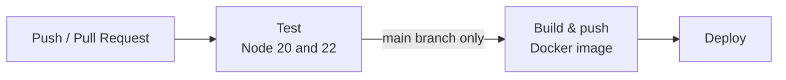

# CI/CD Pipeline

[](https://github.com/amt-kwame-agyabeng/ci-cd-pipeline/actions/workflows/pipeline.yml)

A small Node.js app with a complete CI/CD pipeline built on GitHub Actions. Every push and pull request is tested automatically, and every change merged to `main` is packaged as a Docker image and published to GitHub Container Registry (GHCR).

## How the pipeline works



| Stage | Runs on | What it does |
|-------|---------|--------------|
| **Test** | Every push and pull request to `main` | Installs dependencies with `npm ci` and runs the test suite on Node 20 and Node 22 |
| **Build & push** | Pushes to `main` only, after tests pass | Builds the Docker image and pushes it to `ghcr.io` tagged with the commit SHA and `latest` |
| **Deploy** | After the image is pushed | Currently a placeholder. Replace it with your real deployment step |

The workflow lives in [`.github/workflows/pipeline.yml`](.github/workflows/pipeline.yml).

## Project structure

```
.
├── .github/
│   └── workflows/
│       └── pipeline.yml     # CI/CD workflow
├── src/
│   ├── index.js             # App entry point
│   └── index.test.js        # Tests
├── Dockerfile
├── .dockerignore
├── .gitignore
└── package.json
```

## Getting started

### Prerequisites

- [Node.js](https://nodejs.org/) 20 or newer
- [Docker](https://www.docker.com/) (optional, for running the container locally)

### Run locally

```bash
git clone https://github.com/amt-kwame-agyabeng/ci-cd-pipeline.git
cd ci-cd-pipeline
npm install
npm start
```

The app listens on <http://localhost:3000>.

### Run the tests

```bash
npm test
```

### Run with Docker

Build and run the image locally:

```bash
docker build -t ci-cd-pipeline .
docker run -p 3000:3000 ci-cd-pipeline
```

Or pull the image the pipeline publishes:

```bash
docker pull ghcr.io/amt-kwame-agyabeng/ci-cd-pipeline:latest
docker run -p 3000:3000 ghcr.io/amt-kwame-agyabeng/ci-cd-pipeline:latest
```

If the package is private, log in first with a personal access token that has the `read:packages` scope:

```bash
echo <YOUR_TOKEN> | docker login ghcr.io -u amt-kwame-agyabeng --password-stdin
```

## Configuring the pipeline

### Permissions

The build job uses the built-in `GITHUB_TOKEN` to push to GHCR, so no extra secrets are needed. Make sure workflows can write packages under **Settings → Actions → General → Workflow permissions**.

### Adding a real deployment

Edit the `deploy` job in `pipeline.yml` and replace the placeholder `run` step with your own. Store credentials such as SSH keys or cloud tokens under **Settings → Secrets and variables → Actions**, and reference them as `${{ secrets.NAME }}`. Never commit them to the repository.

### Requiring approval before deploy

The `deploy` job uses the `production` environment. To require a manual approval before it runs, go to **Settings → Environments → production** and add required reviewers.

### Protecting the `main` branch

Under **Settings → Branches**, add a branch protection rule for `main` and require the `Test` status checks to pass before merging.

## Contributing

1. Create a branch: `git checkout -b my-change`
2. Make your changes and add tests
3. Push and open a pull request against `main`
4. Merge once the Test checks pass

## License

Add a license of your choice (for example [MIT](https://choosealicense.com/licenses/mit/)).
